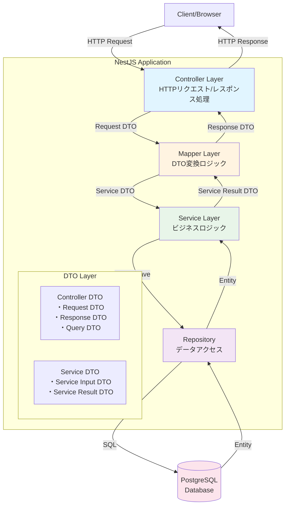
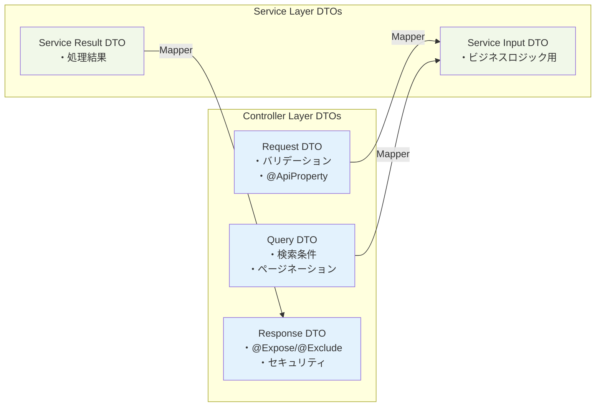
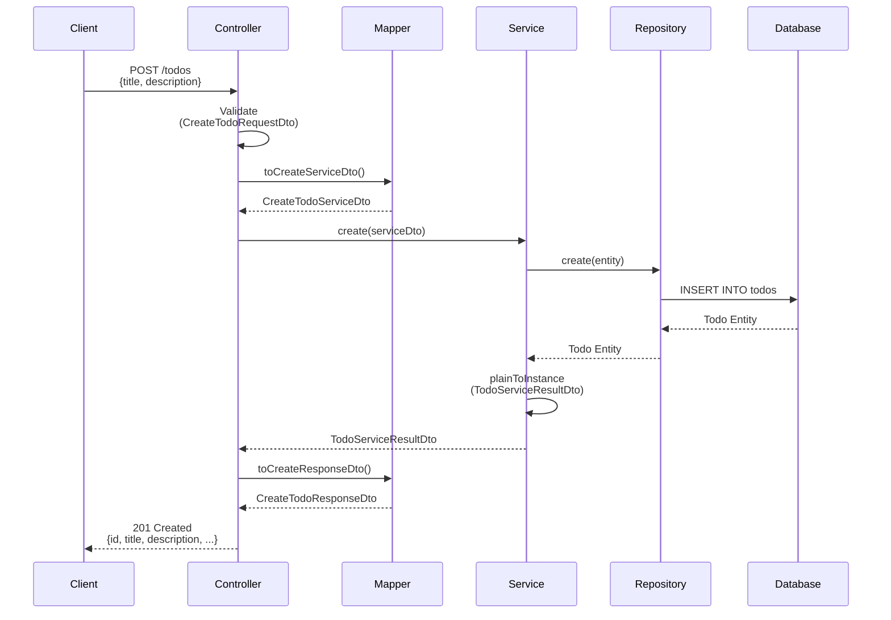

## アーキテクチャ

このプロジェクトは、NestJSのベストプラクティスに従った**レイヤードアーキテクチャ**を採用しています。

### アーキテクチャ概要



### レイヤー責務

#### 1. Controller層

**責務**: HTTPリクエストの受け取りとレスポンスの返却

- リクエストボディのバリデーション（`class-validator`）
- クエリパラメータの処理
- HTTPステータスコードの制御
- Swagger/OpenAPIドキュメント定義

**主なコンポーネント**:

- `@Controller`: ルーティング
- `@Body()`, `@Query()`, `@Param()`: パラメータ取得
- `@ApiTags`, `@ApiOperation`: Swaggerドキュメント

#### 2. Mapper層

**責務**: DTO間の変換ロジックの一元管理

- Controller DTO ↔ Service DTO の変換
- 変換ロジックの再利用
- テスタブルな変換処理

**利点**:

- DRY原則（変換ロジックの重複排除）
- 単一責任の原則
- 変更の局所化

#### 3. Service層

**責務**: ビジネスロジックの実装

- ドメインロジックの処理
- トランザクション管理
- エラーハンドリング
- Repository層の呼び出し

**特徴**:

- Controller層から独立（テスト容易）
- 他のServiceから再利用可能

#### 4. Repository層（TypeORM）

**責務**: データベースアクセス

- CRUD操作
- クエリビルド
- エンティティのマッピング

**パターン**: TypeORMのRepository Patternを使用

### DTO設計



#### Controller層DTO

```
src/todos/dto/controller/
├── request/              # リクエストDTO
│   ├── create-todo-request.dto.ts    # 作成リクエスト
│   ├── update-todo-request.dto.ts    # 更新リクエスト
│   └── find-all-todos-query.dto.ts   # 検索クエリ
└── response/             # レスポンスDTO
    ├── create-todo-response.dto.ts
    ├── find-all-todos-response.dto.ts
    ├── find-one-todo-response.dto.ts
    ├── update-todo-response.dto.ts
    └── paginated-todos-response.dto.ts
```

#### Service層DTO

```
src/todos/dto/service/
├── create-todo-service.dto.ts    # Service層への入力
├── update-todo-service.dto.ts    # Service層への入力
└── todo-service-result.dto.ts    # Service層からの出力
```

### データフロー例（TODO作成）



### 主要機能

#### ページネーション・フィルタリング

```bash
GET /todos?completed=false&page=1&limit=10&sortBy=createdAt&order=DESC
```

**QueryDTO**:

- `completed`: 完了状態フィルタ
- `page`: ページ番号（デフォルト: 1）
- `limit`: 1ページあたりの件数（デフォルト: 10、最大: 100）
- `sortBy`: ソート項目（createdAt, updatedAt, title）
- `order`: ソート順（ASC, DESC）

**レスポンス**:

```json
{
  "data": [...],
  "total": 100,
  "page": 1,
  "limit": 10,
  "totalPages": 10
}
```

#### バリデーション

- `class-validator`: リクエストDTOの自動バリデーション
- `class-transformer`: DTOの自動変換
- グローバルValidationPipe設定

#### セキュリティ

- `@Exclude()` / `@Expose()`: レスポンスフィールドの制御
- エンティティを直接返さない（必ずDTOに変換）
- 環境変数による設定管理

### ディレクトリ構造

```
src/
├── entities/              # TypeORMエンティティ
│   └── todo.entity.ts
├── todos/                 # TODOモジュール
│   ├── dto/
│   │   ├── controller/    # Controller層DTO
│   │   │   ├── request/
│   │   │   └── response/
│   │   └── service/       # Service層DTO
│   ├── mappers/           # Mapper層
│   │   └── todo.mapper.ts
│   ├── todos.controller.ts
│   ├── todos.service.ts
│   └── todos.module.ts
├── modules/
│   └── health/            # ヘルスチェック
├── migrations/            # TypeORMマイグレーション
└── main.ts
```

## Project setup

```bash
$ npm install
```

## Compile and run the project

```bash
# development
$ npm run start

# watch mode
$ npm run start:dev

# production mode
$ npm run start:prod
```

## Run tests

```bash
# unit tests
$ npm run test

# e2e tests
$ npm run test:e2e

# test coverage
$ npm run test:cov
```

## Database Migration (TypeORM)

このプロジェクトではTypeORMを使用してデータベーススキーマを管理しています。

### マイグレーションの生成

エンティティを変更した後、以下のコマンドでマイグレーションファイルを生成します:

```bash
$ npm run migration:generate src/migrations/<MigrationName>
```

例:

```bash
$ npm run migration:generate src/migrations/AddUserTable
```

### マイグレーションの実行

生成されたマイグレーションをデータベースに適用します:

```bash
$ npm run migration:run
```

### マイグレーションの取り消し

最後に実行したマイグレーションを取り消します:

```bash
$ npm run migration:revert
```

### マイグレーション状態の確認

実行済みのマイグレーションを確認します:

```bash
$ npm run migration:show
```

### 注意事項

- マイグレーションは必ずバージョン管理に含めてください
- 本番環境では `synchronize: false` が設定されているため、必ずマイグレーションを実行してください
- マイグレーション実行前にデータベースのバックアップを取ることを推奨します

## Deployment

When you're ready to deploy your NestJS application to production, there are some key steps you can take to ensure it runs as efficiently as possible. Check out the [deployment documentation](https://docs.nestjs.com/deployment) for more information.

If you are looking for a cloud-based platform to deploy your NestJS application, check out [Mau](https://mau.nestjs.com), our official platform for deploying NestJS applications on AWS. Mau makes deployment straightforward and fast, requiring just a few simple steps:

```bash
$ npm install -g @nestjs/mau
$ mau deploy
```

With Mau, you can deploy your application in just a few clicks, allowing you to focus on building features rather than managing infrastructure.

## Resources

Check out a few resources that may come in handy when working with NestJS:

- Visit the [NestJS Documentation](https://docs.nestjs.com) to learn more about the framework.
- For questions and support, please visit our [Discord channel](https://discord.gg/G7Qnnhy).
- To dive deeper and get more hands-on experience, check out our official video [courses](https://courses.nestjs.com/).
- Deploy your application to AWS with the help of [NestJS Mau](https://mau.nestjs.com) in just a few clicks.
- Visualize your application graph and interact with the NestJS application in real-time using [NestJS Devtools](https://devtools.nestjs.com).
- Need help with your project (part-time to full-time)? Check out our official [enterprise support](https://enterprise.nestjs.com).
- To stay in the loop and get updates, follow us on [X](https://x.com/nestframework) and [LinkedIn](https://linkedin.com/company/nestjs).
- Looking for a job, or have a job to offer? Check out our official [Jobs board](https://jobs.nestjs.com).

## Support

Nest is an MIT-licensed open source project. It can grow thanks to the sponsors and support by the amazing backers. If you'd like to join them, please [read more here](https://docs.nestjs.com/support).

## Stay in touch

- Author - [Kamil Myśliwiec](https://twitter.com/kammysliwiec)
- Website - [https://nestjs.com](https://nestjs.com/)
- Twitter - [@nestframework](https://twitter.com/nestframework)

## License

Nest is [MIT licensed](https://github.com/nestjs/nest/blob/master/LICENSE).
